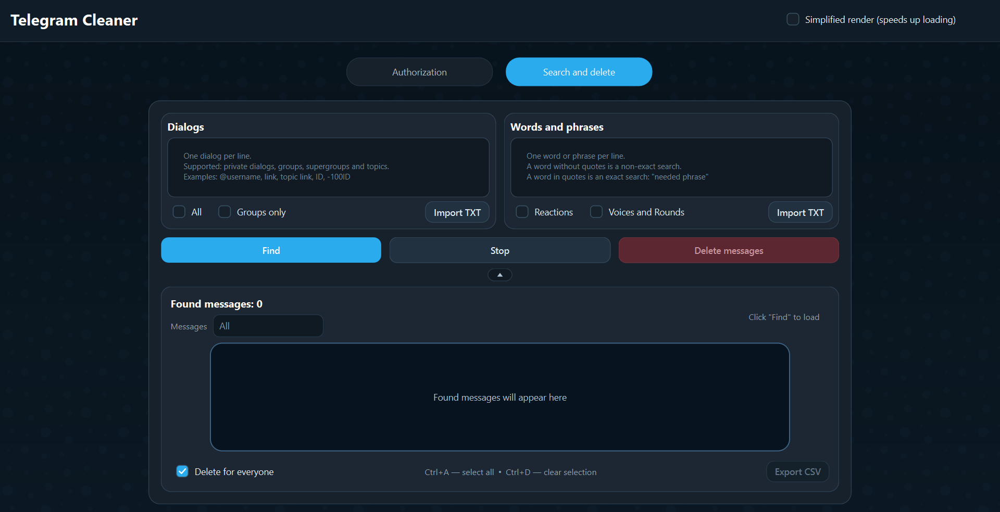

# Telegram Cleaner

A desktop application for searching, filtering, exporting, and cleaning up Telegram messages from your own account.

Telegram Cleaner can search messages in private dialogs, groups, supergroups, and topics, search by words and phrases, find messages with your reactions, work with voice messages and round videos through Telegram transcription, export results to CSV, and delete selected messages or reactions.



> This project is not affiliated with Telegram and is intended for personal cleanup, research, moderation, and data export from your own account.

---

## What the app can do

- Search messages in selected dialogs.
- Search across all available dialogs.
- Search only in groups and supergroups.
- Search inside Telegram topics.
- Search by words and phrases.
- Find messages where your reaction is set.
- Search voice messages and round videos by transcription text.
- Export found messages to CSV.
- Delete selected found messages.
- Remove your reactions from selected messages.

---

## How to use

1. Enter your **Telegram API ID**.
2. Enter your **Telegram API Hash**.
3. Enter your phone number in international format.
4. Log in using the code from Telegram.
5. If two-step verification is enabled, enter your 2FA password.
6. Specify dialogs, words, and the needed search modes.
7. Click **Find**.
8. Select the found messages you want to delete or export.

The API ID, API Hash, phone number, selected language, and simplified render mode are saved between app launches.

Please note:

- The app may report that the login code has been sent, but the code itself may not arrive due to Telegram API limitations. In that case, try again later;
- If new messages do not appear, try restarting the app.

---

## Why do I need Telegram API ID and API Hash?

Telegram Cleaner works as a local Telegram client for your account.

To connect to Telegram through the official Telegram API, third-party applications need an `api_id` and `api_hash`. These values identify the application that connects to Telegram.

This is not a bot token.\
This is not your Telegram password.

You create the API ID and API Hash yourself on Telegram's official website.

---

## How to get Telegram API ID and API Hash

1. Sign in to Telegram using the official Telegram app.
2. Open [https://my.telegram.org](https://my.telegram.org)
3. Log in with your phone number.
4. Open **API development tools**.
5. Fill in the application form.
6. Copy your `api_id` and `api_hash`.
7. Paste them into Telegram Cleaner.

Do not publish your `api_hash`.\
Do not commit it to GitHub.\
Do not send it to other people.

---

## Dialog field

Enter one dialog per line.

Supported formats:

```text
@username
https://t.me/username
https://t.me/c/1234567890/123
https://t.me/c/1234567890/123?topic=456
123456789
-1001234567890
```

In these examples, the numbers are IDs: a user ID, group ID, or supergroup ID. The `-100...` format is usually used by Telegram for supergroups and channels. In `t.me/c/...` links, the numbers point to the internal group/supergroup ID and the message or topic ID. Replace the examples with real IDs or real links from your Telegram dialogs.

Supported dialog types:

- private dialogs;
- groups;
- supergroups;
- topics.

Please note:

- If you paste a topic link, Telegram Cleaner will search specifically inside that topic, not across the entire group;
- If the status shows that not all dialogs were processed after loading is complete, this may be caused by an API request error. In this case, try running the loading process again.

---

## Word and phrase field

Enter one word or phrase per line.

Normal search:

```text
hello
needed phrase
```

This is a non-exact substring search.

Exact search:

```text
"hello"
"needed phrase"
```

Words and phrases in quotes are searched as exact words or exact phrases. This helps avoid matches inside other words.

For example:

```text
"cat"
```

will find:

```text
cat
my cat
```

but should not find:

```text
cats
cat's
```

---

## Search modes

### Selected dialogs

The default mode.

You manually enter one or more dialogs, and Telegram Cleaner searches only inside them.

---

### All dialogs

The **All** checkbox near the dialog field ignores the dialog field and searches across all available dialogs.

---

### Groups only

The **Groups only** mode ignores the dialog field and searches only in groups and supergroups available to your account.

---

### Reactions

The **Reactions** mode searches for messages where your reaction is set.

In this mode, results may include messages from other users, because the main condition is your reaction on the message.

If this mode is selected, you delete reactions, not messages.

---

### Voices and rounds

The **Voices and rounds** mode searches through voice messages and round videos.

Telegram Cleaner requests transcription text from Telegram, saves successful transcriptions in a local cache, and then searches through that text.

---

### Voices and rounds + Reactions

If **Voices and rounds** and **Reactions** are enabled at the same time, Telegram Cleaner will search for voice messages or round videos where your reaction is set.

In other words, the mode works like this:

```text
voice/round video + your reaction + transcription match
```

---

## Deleting messages and reactions

You can select found results and delete them for yourself or for everyone.

Telegram Cleaner can:

- Delete selected messages;
- Remove your reactions from selected messages.

Please note:

- Deleted messages cannot be restored through Telegram Cleaner;
- Reactions and messages in groups can only be deleted for everyone;
- Reactions are removed slowly because of Telegram API limits, keep this in mind.

---

## Where is the session stored?

Telegram Cleaner stores your Telegram session locally on your computer.

Session files are created near the application in the `users` folder:

```text
users/<phone_number>/tg_cleaner_session.session
```

The voice transcription cache is also stored locally:

```text
users/<phone_number>/voice_transcriptions.json
```

Saved interface fields are stored in the current Windows user's registry branch:

```text
HKEY_CURRENT_USER\Software\TelegramCleaner
```

Telegram Cleaner does not use its own server for your session. The application connects from your computer directly to Telegram through the Telegram API.

Since the project is open source, you can open the code and check exactly what is stored and where.

It is not recommended to constantly delete the session and log in again every time you use the app, because this may temporarily block your API login.

---

## Can I trust the session?

The session is a regular local authorization file used by Telegram client libraries.

It is needed so you do not have to log in again every time you launch the app.

Important points:

- The session file stays on your computer.
- Do not upload the `users` folder to GitHub.
- Do not send `.session` files to other people.
- If you need to reset authorization, delete the corresponding folder inside `users` or log out through the app.
- If you do not trust the app, you can close the app session through the official Telegram client: go to `Settings -> Devices`, select the device with the name you entered when registering the API, and log it out.

---

## Performance

Large result lists can put a heavy load on the interface.

If more than 5000 messages are found, Telegram Cleaner may suggest enabling simplified render mode. It displays results faster by using a lighter message view.

If you resize the window while many results are visible, the app may temporarily show a resizing screen and then restore the message list.

The app can also become heavy when displaying a large number of messages, so it is not recommended to move or resize the window during rendering. Just wait, enable simplified render, or load results gradually in batches by stopping loading.

---

## Experimental "All" mode for messages

The app has an experimental **All** mode for messages. It is intentionally disabled in public builds because it can be very heavy: the mode can find all your messages in groups, all your reactions wherever they are, and all voice messages.

To try it, you need to build the app yourself and specify your Telegram username in the config:

```python
ADMIN_USERNAME = "your_username_without_@"
```

The value is located in this file:

```text
tgcleaner/core/config.py
```

After changing it, rebuild the `.exe` by running `builder.bat`. The feature will appear only for the Telegram account whose username matches `ADMIN_USERNAME`.

Use this mode carefully. It is experimental and is not recommended for normal cleanup.

---

## Install and run

1. Open the **[Releases](../../releases)** tab of this repository.
2. Download `TelegramCleaner-<version>-win-x64.zip`.
3. Unzip the archive.
4. Run `TelegramCleaner.exe`.

---

## Windows Defender warning

On first launch, Windows Defender or SmartScreen may show a warning because the app is distributed as an unsigned `.exe` file from an independent developer.

This does not automatically mean that the app is malicious.

If you downloaded the archive from the official Releases page of this repository, you can allow it to run.

Telegram Cleaner does not inject into Telegram Desktop, does not modify Telegram Desktop, and does not patch anything. It is a separate client that connects to Telegram through the Telegram API.

---

## Author

SqwireX

---

---

# Telegram Cleaner — Русский

Десктопное приложение для поиска, фильтрации, экспорта и очистки сообщений Telegram со своего аккаунта.

Telegram Cleaner умеет искать сообщения в личных диалогах, группах, супергруппах и топиках, искать по словам и фразам, находить сообщения с вашими реакциями, работать с голосовыми и кружками через транскрибацию Telegram, экспортировать результаты в CSV и удалять выбранные сообщения или реакции.

> Проект не связан с Telegram и предназначен для личной очистки, исследования, модерации и экспорта данных со своего аккаунта.

---

## Что умеет приложение

- Искать сообщения в выбранных диалогах.
- Искать по всем доступным диалогам.
- Искать только по группам и супергруппам.
- Искать внутри топиков Telegram.
- Искать по словам и фразам.
- Находить сообщения, на которых стоит ваша реакция.
- Искать голосовые сообщения и кружки по тексту транскрибации.
- Экспортировать найденные сообщения в CSV.
- Удалять выбранные найденные сообщения.
- Удалять ваши реакции с выбранных сообщений.

---

## Как использовать

1. Введите **Telegram API ID**.
2. Введите **Telegram API Hash**.
3. Введите номер телефона в международном формате.
4. Авторизуйтесь через код от Telegram.
5. Если включена двухэтапная проверка, введите пароль 2FA.
6. Укажите диалоги, слова и нужные режимы поиска.
7. Нажмите **Найти**.
8. Выберите найденные сообщения, которые нужно удалить или экспортировать.

API ID, API Hash, номер телефона, выбранный язык и режим упрощённого рендера сохраняются между запусками приложения.

Будьте внимательны:

- Приложение может сообщить, что код отправлен, но сам код может не прийти из-за ограничений API Telegram. В таком случае попробуйте снова позже;
- Если новые сообщения не появляются, попробуйте перезапустить приложение.

---

## Зачем нужны Telegram API ID и API Hash?

Telegram Cleaner работает как локальный Telegram-клиент для вашего аккаунта.

Чтобы подключаться к Telegram через официальный Telegram API, сторонним приложениям нужны `api_id` и `api_hash`. Эти значения определяют приложение, которое подключается к Telegram.

Это не токен бота.\
Это не пароль от Telegram.

Вы создаёте API ID и API Hash самостоятельно на официальном сайте Telegram.

---

## Как получить Telegram API ID и API Hash

1. Войдите в Telegram через официальное приложение.
2. Откройте [https://my.telegram.org](https://my.telegram.org)
3. Войдите по номеру телефона.
4. Откройте **API development tools**.
5. Заполните форму приложения.
6. Скопируйте `api_id` и `api_hash`.
7. Вставьте их в Telegram Cleaner.

Не публикуйте свой `api_hash`.\
Не коммитьте его в GitHub.\
Не отправляйте его другим людям.

---

## Если my.telegram.org не открывается в РФ

Этот раздел только для пользователей с российскими номерами или проблемами доступа из РФ.

Некоторые пользователи сообщают, что `my.telegram.org` может выдавать ошибку при создании `api_id` / `api_hash` с российских IP-адресов. Один из способов решения — добавить прямую запись для `my.telegram.org` в файл `hosts`.

Возможный способ решения для Windows:

1. Отключите VPN.
2. Откройте Блокнот от имени администратора.
3. Откройте файл:

```text
C:\Windows\System32\drivers\etc\hosts
```

4. Добавьте в конец файла строку:

```text
149.154.167.220 my.telegram.org
```

5. Сохраните файл.
6. Перезапустите браузер.
7. Снова откройте [https://my.telegram.org](https://my.telegram.org) и попробуйте создать `api_id` и `api_hash`.

Это не официальная инструкция Telegram. Это может перестать работать. Если после этого появляются проблемы, удалите добавленную строку из `hosts`.

---

## Поле диалогов

Вводите по одному диалогу на строку.

Поддерживаются форматы:

```text
@username
https://t.me/username
https://t.me/c/1234567890/123
https://t.me/c/1234567890/123?topic=456
123456789
-1001234567890
```

В этих примерах цифры — это ID: ID пользователя, группы или супергруппы. Формат `-100...` обычно используется Telegram для супергрупп и каналов. В ссылках `t.me/c/...` числа указывают на внутренний ID группы/супергруппы и ID сообщения или топика. Вместо примеров нужно вставлять реальные ID или реальные ссылки из ваших диалогов Telegram.

Поддерживаемые типы диалогов:

- личные диалоги;
- группы;
- супергруппы;
- топики.

Будьте внимательны:

- Если вставить ссылку на топик, Telegram Cleaner будет искать сообщения именно внутри этого топика, а не во всей группе;
- Если после завершения загрузки в статусе указано, что обработаны не все диалоги, это может быть связано с ошибкой API-запроса. В таком случае попробуйте запустить загрузку повторно.

---

## Поле слов и фраз

Вводите одно слово или фразу на строку.

Обычный поиск:

```text
привет
нужная фраза
```

Это неточный поиск по вхождению строки.

Точный поиск:

```text
"привет"
"нужная фраза"
```

Слова и фразы в кавычках ищутся как точные слова или точные фразы. Это помогает не находить совпадения внутри других слов.

Например:

```text
"кот"
```

найдёт:

```text
кот
мой кот
```

но не должен находить:

```text
коты
кота
```

---

## Режимы поиска

### Выбранные диалоги

Обычный режим по умолчанию.

Вы вручную вводите один или несколько диалогов, а Telegram Cleaner ищет только внутри них.

---

### Все диалоги

Галочка **Все** возле поля диалогов игнорирует поле диалогов и ищет по всем доступным диалогам.

---

### Только группы

Режим **Только группы** игнорирует поле диалогов и ищет только по группам, супергруппам, доступным вашему аккаунту.

---

### Реакции

Режим **Реакции** ищет сообщения, на которых стоит ваша реакция.

В этом режиме в результатах могут быть сообщения других пользователей, потому что главное условие — ваша реакция на сообщении.

Если выбран этот режим, то вы удаляете реакции, не сообщения.

---

### Голосовые и кружки

Режим **Голосовые и кружки** ищет по голосовым сообщениям и кружкам.

Telegram Cleaner запрашивает у Telegram текст транскрибации, сохраняет успешные транскрибации локально в кэш и потом ищет по этому тексту.

---

### Голосовые и кружки + Реакции

Если включить **Голосовые и кружки** и **Реакции** одновременно, Telegram Cleaner будет искать голосовые сообщения или кружки, на которых стоит ваша реакция.

То есть режим работает так:

```text
голосовое/кружок + ваша реакция + совпадение по транскрибации
```

---

## Удаление сообщений и реакций

Можно выбрать найденные результаты и удалить их как для себя, так и для всех.

Telegram Cleaner умеет:

- Удалять выбранные сообщения;
- Удалять ваши реакции с выбранных сообщений.

Будьте внимательны:

- Удалённые сообщения нельзя восстановить через Telegram Cleaner;
- Удалять реакции и сообщения в группах можно только у всех;
- Реакции удаляются медленно из-за ограничений API Telegram, учтите это.

---

## Где хранится сессия?

Telegram Cleaner хранит Telegram-сессию локально на вашем компьютере.

Файлы сессии создаются рядом с приложением в папке `users`:

```text
users/<номер_телефона>/tg_cleaner_session.session
```

Кэш транскрибаций голосовых тоже хранится локально:

```text
users/<номер_телефона>/voice_transcriptions.json
```

Сохранённые поля интерфейса хранятся в ветке реестра текущего пользователя Windows:

```text
HKEY_CURRENT_USER\Software\TelegramCleaner
```

Telegram Cleaner не использует собственный сервер для вашей сессии. Приложение подключается с вашего компьютера напрямую к Telegram через API Telegram.

Так как проект open source, вы можете открыть код и проверить, что именно и куда сохраняется.

Не рекомендуется постоянно удалять сессию и заходить снова при каждом использовании приложения, так вы можете временно заблокировать себе вход по API.

---

## Можно ли доверять сессии?

Сессия — это обычный локальный файл авторизации, который используют Telegram client-библиотеки.

Он нужен, чтобы не входить в аккаунт заново при каждом запуске приложения.

Важные моменты:

- Файл сессии остаётся на вашем компьютере.
- Не загружайте папку `users` в GitHub.
- Не отправляйте `.session` файлы другим людям.
- Если нужно сбросить авторизацию, удалите соответствующую папку внутри `users` или выйдите через приложение.
- Если вы не доверяете приложению, вы можете закрыть его сессию через официальный клиент Telegram: откройте `Настройки -> Устройства`, выберите устройство с названием, которое вы указывали при регистрации API, и завершите его сеанс.

---

## Производительность

Большие списки результатов могут нагружать интерфейс.

Если найдено больше 5000 сообщений, Telegram Cleaner может предложить включить упрощённый рендер. Он быстрее отображает результаты за счёт более лёгкого вида сообщений.

Если менять размер окна при большом количестве результатов, приложение может временно показать экран изменения размера, а затем вернуть список сообщений.

Также приложение сильно нагружается, отображая большое количество сообщений, поэтому не рекомендуется перемещать окно или менять размер экрана во время рендера. Просто подождите, включите упрощённый рендер или загружайте сообщения постепенно пачками, останавливая загрузку.

---

## Экспериментальный режим «Все» у сообщений

В приложении есть экспериментальный режим **Все** для сообщений. В публичных сборках он специально отключён, потому что может быть очень тяжёлым: режим способен находить все ваши сообщения в группах, все ваши реакции, где бы то ни было и все голосовые.

Чтобы попробовать его, нужно самостоятельно собрать приложение и указать свой Telegram username в конфиге:

```python
ADMIN_USERNAME = "ваш_юзернейм_без_@"
```

Значение находится в файле:

```text
tgcleaner/core/config.py
```

После изменения пересоберите `.exe`, запустив `builder.bat`. Функция появится только у того Telegram-аккаунта, username которого совпадает с `ADMIN_USERNAME`.

Используйте этот режим аккуратно. Он экспериментальный и не рекомендуется для обычной очистки.

---

## Установка и запуск

1. Откройте вкладку **[Releases](../../releases)** этого репозитория.
2. Скачайте архив `TelegramCleaner-<версия>-win-x64.zip`.
3. Распакуйте архив.
4. Запустите `TelegramCleaner.exe`.

---

## Предупреждение Windows Defender

При первом запуске Windows Defender или SmartScreen может показать предупреждение, потому что приложение распространяется как неподписанный `.exe`-файл от независимого разработчика.

Само по себе это не означает, что приложение вредоносное.

Если вы скачали архив с официальной страницы Releases этого репозитория, запуск можно разрешить.

Telegram Cleaner не внедряется в Telegram Desktop, не изменяет Telegram Desktop и ничего не патчит. Это отдельный клиент, который подключается к Telegram через API Telegram.

---

## Автор

SqwireX
